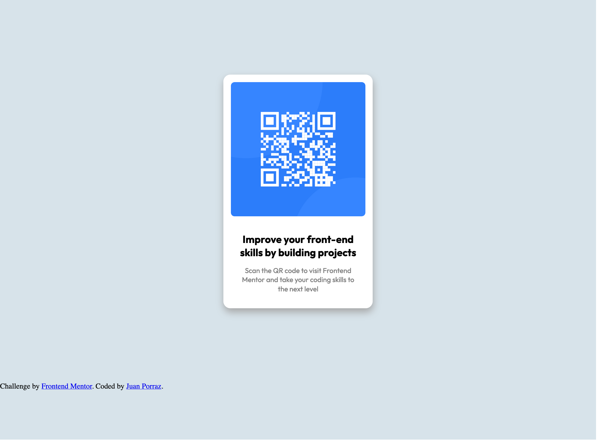

# Frontend Mentor - QR code component solution

This is a solution to the [QR code component challenge on Frontend Mentor](https://www.frontendmentor.io/challenges/qr-code-component-iux_sIO_H). Frontend Mentor challenges help you improve your coding skills by building realistic projects.

## Table of contents

- [Overview](#overview)
  - [Screenshot](#screenshot)
  - [Links](#links)
- [My process](#my-process)
  - [Built with](#built-with)
  - [What I learned](#what-i-learned)
  - [Continued development](#continued-development)
  - [Useful resources](#useful-resources)
- [Author](#author)

## Overview

### Screenshot



### Links

- Solution URL: [Add solution URL here](https://github.com/SpinyKeyboard88/Frontend-Mentor-Projects/tree/main/QR-code-component)
- Live Site URL: [Add live site URL here](https://www.pizzasloth82.com/Frontend-Mentor-Projects/QR-code-component/index.html)

## My process

I studied both the mobile view and the desktop view and realized that it was just a card component. So I looked at it from top to bottom and thought how it would look like as a flex component.

I knew that it would be a column starting with the image on the top, first text, then the final text.

I made sure to group the text together in it's own div and the image by itself. I also made them different tags so it was easier for me to style them changed the colors for the two different texts.

### Built with

- Sass for styling
- Flexbox

### What I learned

Since I have some experience with making cards, It was easier for me to make one for this QR code component. I do know there are far better ways to improve this, but for now, this is what i had come up with.

I ended up not using all of the provided styling because i thought it looked nicer already the way i had it

```scss
.card {
  display: flex;
  flex-direction: column;
  text-align: center;
  width: 20rem;
  background-color: white;
  padding-bottom: 2rem;
  box-shadow: 1px 0.5rem 1rem hsl(0, 0%, 65%);

  border-radius: 15px;

  .image {
    margin: 1rem;

    #QRcode {
      border-radius: 0.5rem;
      max-width: 100%;
    }
  }
  .text {
    margin: 0 1.5rem;
    font-family: "Outfit", sans-serif;

    h1 {
      font-family: "Outfit", sans-serif;
      font-weight: 700;
      font-size: 22px;
    }
    p {
      margin: 0 0.5rem;
      font-size: 15px;

      font-weight: 400;
      color: gray;
    }
  }
}
```

### Continued development

I'm still not fully experienced with making a layout for how things should look (like making the card). I want to be able to know what is the most efficent way to put things into divs so i can go back and fix them if I need to.

I want to be able to reuse code that I write everywhere so I can be faster in making and debugging.

### Useful resources

- [MDN Web Docs](https://developer.mozilla.org/en-US/) - I have repeatedly beeen using this website to help me understand how some things work

## Author

- Website - [pizzasloth82](https://www.pizzasloth82.com)
- Frontend Mentor - [@SpinyKeyboard88](https://www.frontendmentor.io/profile/SpinyKeyboard88)
- Twitter - [@pizzasloth82](https://twitter.com/pizzasloth82)
