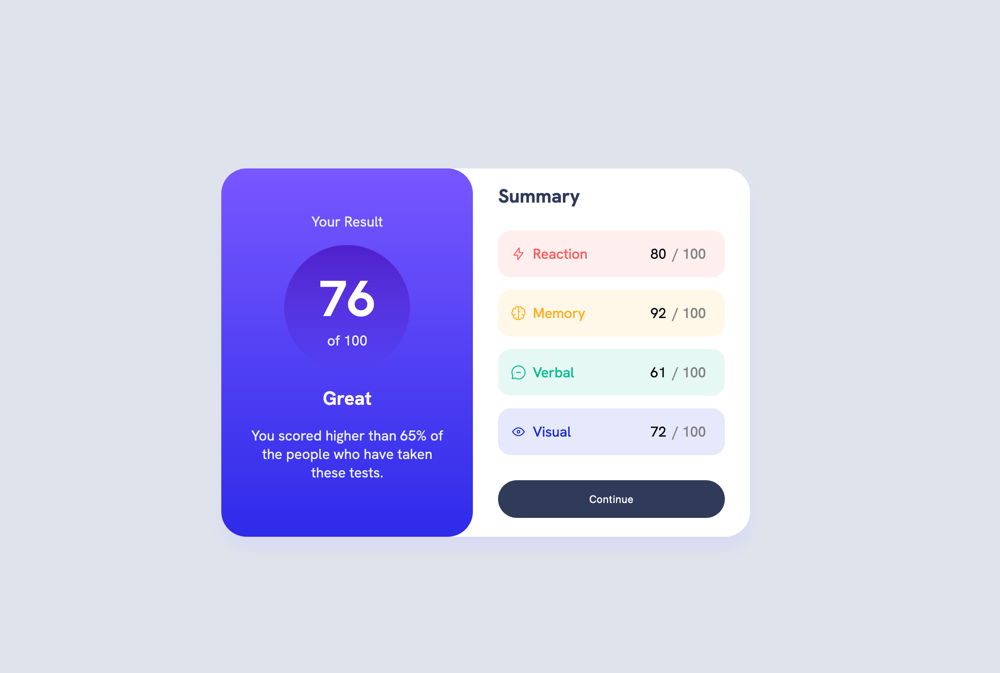

# Frontend Mentor - Results summary component solution

This is a solution to the [Results summary component challenge on Frontend Mentor](https://www.frontendmentor.io/challenges/results-summary-component-CE_K6s0maV). Frontend Mentor challenges help you improve your coding skills by building realistic projects.

## Table of contents

- [Overview](#overview)
  - [The challenge](#the-challenge)
  - [Screenshot](#screenshot)
  - [Links](#links)
- [My process](#my-process)
  - [Built with](#built-with)
  - [What I learned](#what-i-learned)
  - [Continued development](#continued-development)
  - [Useful resources](#useful-resources)
- [Author](#author)

## Overview

### The challenge

Users should be able to:

- View the optimal layout for the interface depending on their device's screen size
- See hover and focus states for all interactive elements on the page
- **Bonus**: Use the local JSON data to dynamically populate the content

### Screenshot



### Links

- Solution URL: [Add solution URL here](https://github.com/SpinyKeyboard88/Frontend-Mentor-Projects/tree/main/Results-Summary-component)
- Live Site URL: [Add live site URL here](https://www.pizzasloth82.com/Frontend-Mentor-Projects/Results-Summary-component/index.html)

## My process

This time I did start with the mobile first view since the mobile site did require something different (the edges on the top and left corners were not rounded).

As i worked with that, it was easier to do everything else. I went through my same thinking using flexbox to determine the right side of the component.

Things started to get more difficult when i was doing the Javascript part. I had to plan out how i was going to edit the tags and how i was going to grab them. the hardest part was just debugging and figuring out why my javascript wasn't working with my console on the web browser. However, once i figured out what i needed to do with using fetch, it was all got easier.

### Built with

- Sass for styling
- Flexbox
- Mobile-first workflow

### What I learned

Since I had some knowledge with working with data on a database, I wanted to try it out with a json file and using Javascript. I've gained an idea of how to use fetch to get a url. I had to use fetch because the other way i was trying it out didn't work for testing.

I also labled the divs with their own classes so i can input the data. though something i do want to fix is having to not hardcode the ids. Maybe for next time if there was more json data, i could do it all programmtically instead of hardcoding the html and the id's.

I am actaully proud of this because it does exactly what i need it do. Another reason why is because i hardly ever manipulate anything in the dom.

```js
fetch(jsonUrl)
  .then((response) => response.json())
  .then((data) => {
    // Process the data once it's loaded
    for (var i = 0; i < data.length; i++) {
      var obj = data[i];

      var idDiv = document.getElementById(obj.category);

      // Access the elements inside the "id" div
      var imgElement = idDiv.querySelector("img");
      var categoryElement = idDiv.querySelector(".category");
      var scoreElement = idDiv.querySelector(".score");

      categoryElement.textContent = `${obj.category}`;
      scoreElement.textContent = `${obj.score}`;
      imgElement.src = `${obj.icon}`;
    }
  })
  .catch((error) => {
    console.error("Error loading JSON:", error);
  });
```

### Continued development

I want to work more with JSON data since I do see it a lot with API's (even though i've had some experience with API's).

Another thing i want to get better at is manipulating things from the DOM with Javascript.

I also want to continue using hsla and linear gradients with css. I really liked how gradients look and like how precise you can be with hsla.

### Useful resources

- [MDN Web Docs](https://developer.mozilla.org/en-US/) - Mozilla once again is very useful having examples for the box shadow, hsla, and gradients.

## Author

- Website - [pizzasloth82](https://www.pizzasloth82.com)
- Frontend Mentor - [@SpinyKeyboard88](https://www.frontendmentor.io/profile/SpinyKeyboard88)
- Twitter - [@pizzasloth82](https://twitter.com/pizzasloth82)
